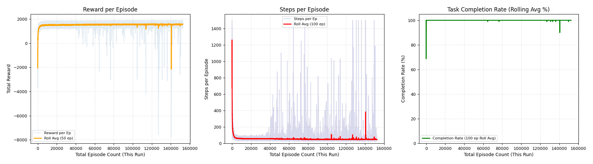

# EmergRoute AI: Ambulance Routing Optimization using RL


## Overview
EmergRoute AI is an intelligent reinforcement learning (RL) system designed to optimize ambulance dispatch and routing decisions. This project uses a modified Taxi environment from the Gymnasium library, adapted to simulate ambulance operations in a grid-based world with patients of varying urgency levels.

The system prioritizes critical patients while efficiently managing ambulance capacity constraints, implementing a sophisticated strategy that significantly improves ambulance response efficiency and patient survival rates.

## Key Features
- **Patient Prioritization**: Intelligently prioritizes critical patients while optimizing overall routing
- **Double Pickup Strategy**: Learns to pick up multiple non-critical patients when efficient
- **Time-Sensitive Rewards**: Implements reward decay functions based on patient wait times
- **Curriculum Learning**: Uses staged training with increasing complexity for robust learning
- **High Performance**: Achieves near-perfect task completion rates (99-100%)

## Project Structure
- `final_model_small_fixes.py`: Main implementation with environment definition and PPO training
- `ppo_modified_taxi_best.zip`: Directory containing saved model checkpoints

## Environment

The environment simulates ambulance operations with the following components:

### State Space
- Ambulance location (row, column)
- Target location (hospital or patient)
- Patients' locations, status (waiting, in-ambulance, delivered), and type (critical/non-critical)
- Capacity indicators showing if the ambulance can pick up different patient types

### Action Space
- Movement: North, South, East, West
- Patient pickup
- Patient dropoff at hospital

### Reward Structure
- MOVE_COST: -1 per movement action
- PICKUP_REWARD_CRITICAL: 250 for picking up critical patients
- PICKUP_REWARD_NON_CRITICAL: 125 for picking up non-critical patients
- SECOND_PICKUP_BONUS: 150 bonus for picking up second non-critical patient
- DROP_OFF_REWARD_CRITICAL: 250 for delivering critical patients
- DROP_OFF_REWARD_NON_CRITICAL: 125 for delivering non-critical patients
- TASK_COMPLETED_REWARD: 100 bonus for completing all deliveries and returning to hospital
- Penalties for invalid actions and time expiration

## Key Innovations

### Time Decay Functions
The system implements various reward decay functions to prioritize timeliness:
```python
def calculate_time_decay(wait_time, deadline, decay_type='sigmoid',
                        decay_rate=1.0, min_factor=0.3,
                        step_threshold=0.75, power_exponent=2.5):
    """
    Calculate time decay factor based on wait time, deadline and decay type
    Returns a value between min_factor and 1.0
    """
    # Normalize wait time as a fraction of deadline
    normalized_time = wait_time / deadline
    
    # Different decay functions implemented:
    # - 'none': Always full reward
    # - 'linear': Linear decay
    # - 'exponential': e^(-decay_rate * normalized_time)
    # - 'accelerating': Slow decay at beginning, accelerates toward deadline
    # - 'power': Even more aggressive late-stage acceleration
    # - 'sigmoid': Softer transitions than linear
    # - 'step': Full reward until threshold, then minimum
    
    # Implementation details in code...
```

### Double Pickup Strategy
The system learns to pick up a second non-critical patient when it's efficient to do so:
```python
# Determine if we should target a second patient pickup
if len(carrying_patients) == 1 and waiting_non_critical:
    # If carrying exactly one non-critical patient and there are waiting non-criticals
    taxi_pos = (self.taxi_row, self.taxi_col)
    closest_idx = None
    closest_dist = float('inf')
    
    # Find closest non-critical patient
    for idx in waiting_non_critical:
        patient_pos = self.patients[idx]['pos']
        dist = abs(taxi_pos[0] - patient_pos[0]) + abs(taxi_pos[1] - patient_pos[1])
        if dist < closest_dist:
            closest_dist = dist
            closest_idx = idx
    
    # Check if the closest patient is nearby or closer than hospital
    if closest_dist <= self.dist or closest_dist < hospital_dist:
        target_pos = self.patients[closest_idx]['pos']
        current_target_r, current_target_c = float(target_pos[0]), float(target_pos[1])
```

## Training Approach

The project uses Proximal Policy Optimization (PPO) from Stable Baselines 3 with:

- Curriculum learning across multiple stages of increasing difficulty
- Custom neural network architecture (512→256→128→64 units)
- Cosine annealing learning rate and entropy coefficient schedulers
- Regular evaluation and checkpointing of best models
- Parallel environment execution for efficient training



## Evaluation Results

### Performance Metrics
After comprehensive evaluation with 100 episodes in each mode:

**Stochastic Policy (exploration enabled)**
- Average Reward: 1561.28 (±109.16)
- Average Steps: 48.5
- Completion Rate: 100.0%
- Double Pickup Rate: 72%
- Total Double Pickups: 87

**Deterministic Policy (pure exploitation)**
- Average Reward: 1528.64 (±318.09)
- Average Steps: 59.8
- Completion Rate: 99.0%
- Double Pickup Rate: 87%
- Total Double Pickups: 118

## Installation and Usage

### Prerequisites
- Python 3.8+
- PyTorch 1.12+
- Stable Baselines 3
- Gymnasium

### Setup
```bash
# Clone the repository
git clone https://github.com/yourusername/emergroute-ai.git
cd emergroute-ai

# Install dependencies
pip install -r requirements.txt

# Run the training script
python final_model_small_fixes.py
```

### Using the Trained Model
```python
from stable_baselines3 import PPO
from final_model_small_fixes import ModifiedTaxiEnv

# Create environment
env = ModifiedTaxiEnv(num_patients=5, 
                      deadline_critical=20, 
                      deadline_non_critical=40)

# Load trained model
model = PPO.load("models/ppo_modified_taxi_best.zip")

# Run inference
obs, _ = env.reset()
done = False
while not done:
    action, _ = model.predict(obs, deterministic=True)
    obs, reward, terminated, truncated, info = env.step(action)
    done = terminated or truncated
    if env.render_mode == "human":
        env.render()
```

## Future Work
- Multi-agent reinforcement learning for fleet coordination
- Integration with real-world GIS and traffic data
- Dynamic patient severity levels and condition changes
- Improved heuristics for hospital selection in multi-hospital scenarios

## Citation
If you use this code in your research, please cite:
```
@misc{emergroute2025,
  author = {John Turner},
  title = {EmergRoute AI: Ambulance Routing Optimization using Reinforcement Learning},
  year = {2025},
  publisher = {GitHub},
  journal = {GitHub Repository},
  howpublished = {\url{https://github.com/AzazelSarie/emergroute-ai}}
}
```

## License
This project is licensed under the MIT License - see the LICENSE file for details.

## Acknowledgments
- This project builds upon the Taxi environment from Gymnasium
- Thanks to the Stable Baselines 3 team for their excellent RL implementations
- Research supported by literature from Pons et al. (2005) and Blackwell & Kaufman (2002)
